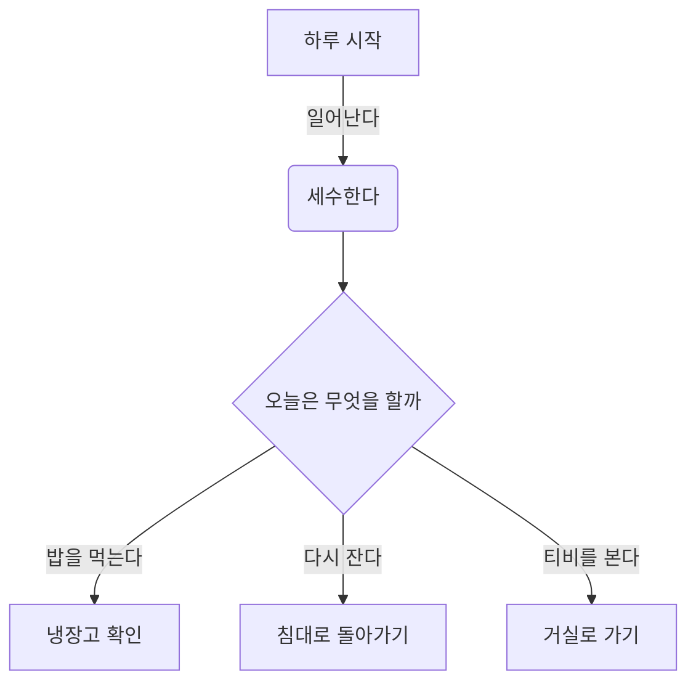
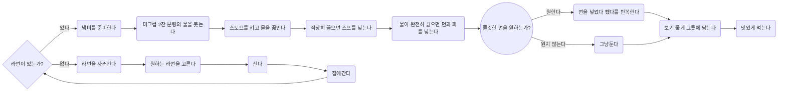
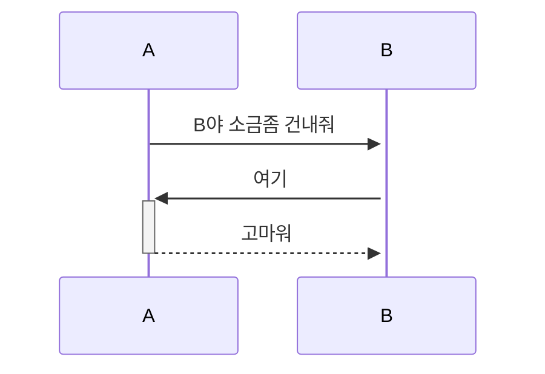
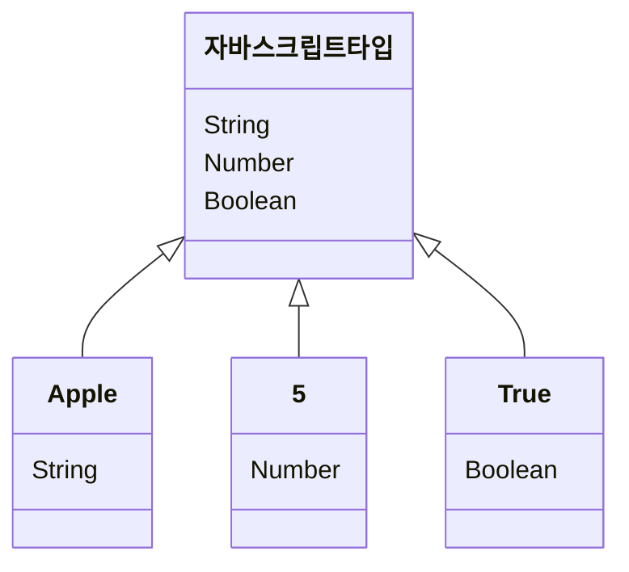
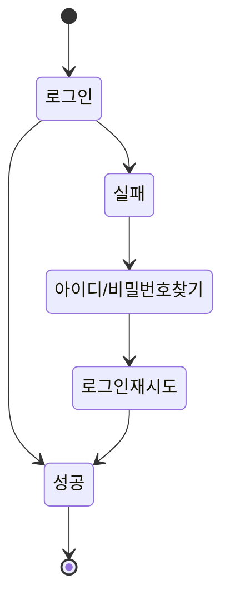
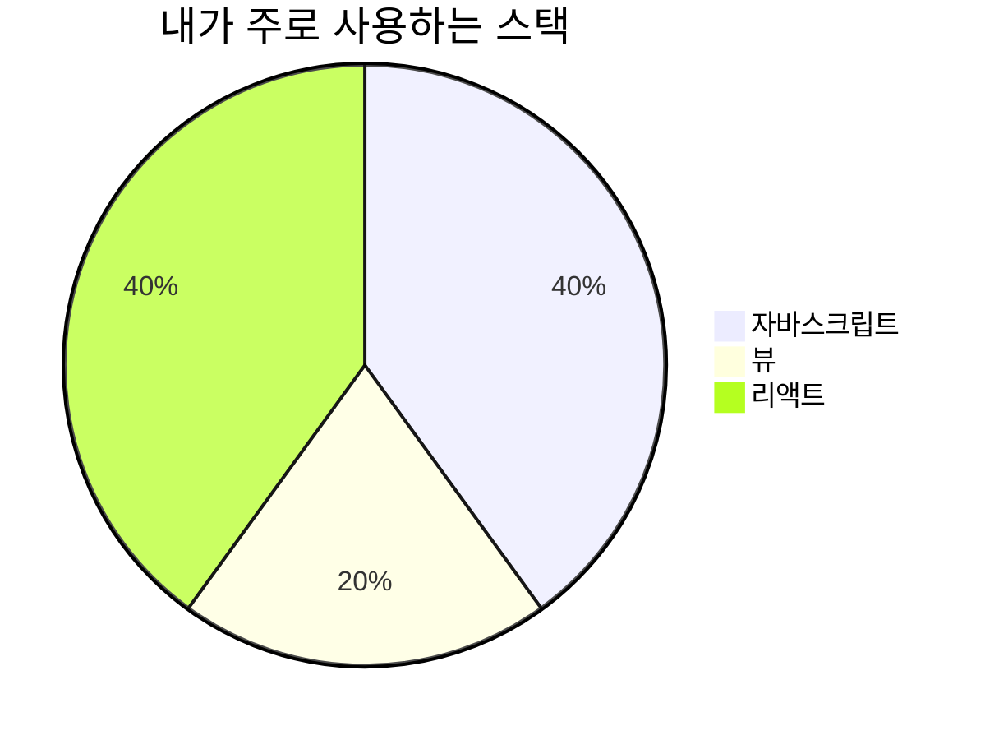
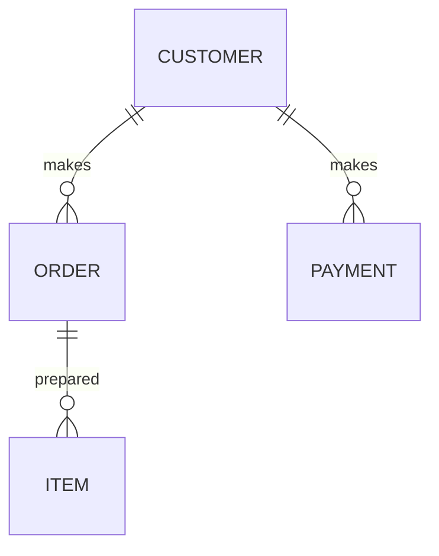
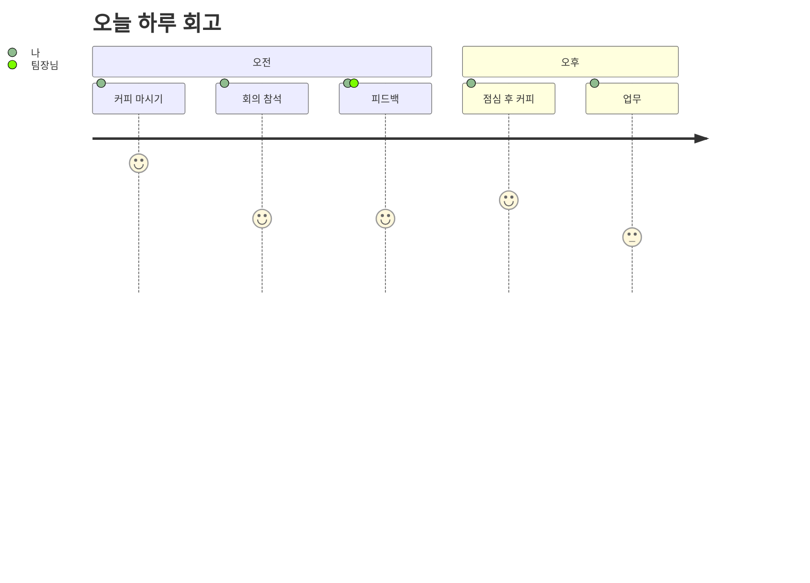

# 1. GUI SW

- 소스트리 (권고)
- 깃크라켄
- 깃허브 데스크탑 (비사용 권고)

# 2. branch 만들기 및 merge test

```bash
# 현재 브랜치 목록과 현재 브랜치 확인
(main) $ git branch

# branch 만들기
(main) $ git branch <브랜치이름>

# branch 이동
(main) $ git checkout <브랜치이름>

# branch.txt 파일 생성
(yoorimseo) $ touch branch.txt

(yoorimseo) $ git status
(yoorimseo) $ git add branch.txt
(yoorimseo) $ git commit -m 'docs: branch.txt 생성 및 초기 내용 작성'

# 초기 push할 때만 다음 명령어 사용
  # `git push <원격저장소명> <브랜치명>` 는 어느 원격 저장소의 어느 브랜치에 push할 지 전달한다.
  # `git push` 는  할 때에는 이미 연결된 곳에 push할 수 있지만, 원격 저장소에 해당 브랜치가 없는 경우에는 `git push -u origin <브랜치명>` 을 실행해야 이후에 간단히 push할 수 있다.
  # `-u` 옵션이  `--set -upstream` 이다.
(yoorimseo) $ git push --set-upstream origin yoorimseo

# merge(합병)하기
(yoorimseo) $ git checkout main
(yoorimseo) $ git log

(main) $ git merge yoorimseo
(main) $ git log
```

# 3. conflict test

```bash
# README.md 파일 수정 > Hello I'm main branch!
(main) $ git add .
(main) $ git commit -m 'docs: main branch > README.md 수정'
(main) $ git push

(main) $ git branch testA
(main) $ git branch testB

(main) $ git checkout testA
# README.md 파일 수정 > Hello I'm testA branch!
(testA) $ git add .
(testA) $ git commit -m 'docs: testA branch > README.md 수정'
(testA) $ git push --set-upstream origin testA

(testA) $ git checkout testB
# README.md 파일 수정 > Hello I'm testB branch!
(testB) $ git add .
(testB) $ git commit -m 'docs: testB branch > README.md 수정'
(testB) $ git push --set-upstream origin testB
(testB) $ git checkout main

(main) $ git merge testA
(main) $ git merge testB # error!
# Auto-merging README.md
# CONFLICT (content): Merge conflict in README.md
# Automatic merge failed; fix conflicts and then commit the result.

# README.md 파일 수정 > Hello I'm testA branch!
<<<<<<< HEAD
Hello I'm testA branch!
=======
Hello I'm testB branch!
>>>>>>> testB

(main) $ git add .
(main) $ git commit -m 'fix: testA와 testB의 conflict 해결'
(main) $ git push

-------------------------------------------

# branch 삭제
$ git branch -D <삭제할 브랜치명>

# 모든 참조 목록을 확인 > 삭제한 브랜치의 마지막 커밋 해시값을 확인한다.
$ git reflog

# 브랜치를 복구
$ git checkout -b <삭제한 브랜치명> <커밋 해시값>
```

# 4. amend, stash, reset, cherry-pick

## 4.1 amend

```bash
# 최신 커밋에 누락된 파일을 추가하고 싶을 때 사용
$ git add amend.txt
$ git commit --amend
```

---

## 4.2 stash

현재 브랜치에서 아직 커밋 하지 못한 파일들이 있는데, 다른 브랜치로 넘어가야 하는 경우 현재 브랜치의 변경사항을 잠시 보관할 때 사용

- Tracked : git 저장소에서 관리하는 파일
- UnTracked : git 저장소에서 관리하지 않는 파일

---

### 4.2.1 Tracked 파일을 stash하는 경우

```bash
touch test.txt

git stash  # 수행 중이던 작업을 임시 저장하고 가장 최근 커밋 상태로 만든다.

git status

git stash pop # 다른 브랜치에서 작업을 하고 돌아온 후, 가장 최근에 임시 저장한 내용을 가져온다. (스테이지 상태까지 그대로 복원하지는 않는다.)
```

---

### 4.2.2 UnTracked 파일 stash하는 경우

```bash
$ touch test.txt
$ git stash
$ git status

# 기본적으로 stash 명령어는 git 저장소에서 관리하고 있는 파일들만 임시 저장을 해주기 때문에, 새로 생성한 파일(git 저장소에서 관리하지 않는 파일)까지 모두 저장하고 싶은 경우에는 명령어 뒤에 --all 모드를 붙여주면 된다.
$ git stash pop
$ git stash --all
$ git status
```

---

### 4.2.3 stash mode 소개

```bash
$ git stash # 저장하기

$ git stash save [description] # 설명 추가하면서 저장하기

$ git stash list # stash 리스트 보여주기
# stash@{0}: WIP on main: 06c4e12 test <- 이런식으로 stash의 목록을 보여줍니다.
# stash@{1}: WIP on main: 02bde12 other

$ git stash apply # 가장 최근 stash 가져와 적용 (stash에서 삭제는 안됩니다.)
$ git stash apply --index # staged된 상태까지 적용하고 싶은 경우

$ git stash drop  # 가장 최근 stash 내용 삭제
$ git stash drop stash@{숫자} # 해당하는 친구 삭제

$ git stash pop # 위에 있는 apply와 drop을 합친 키워드 -> 가장 최근 stash 내용 적용 및 삭제

$ git stash clear  # 전체 삭제
```

---

## 4.3 reset

브랜치에 여러가지 버전을 올린 후 이전 커밋으로 브랜치를 되돌릴 때 사용한다.

돌아간 커밋 내역 이후의 커밋 히스토리들을 초기화한다.

때문에, 기존에 push가 된 상태에서 reset을 사용한 후, 다시 push를 하면 로컬 저장소의 최신 히스토리와 원격 저장소의 최신 히스토리가 다르기 때문에 에러가 발생한다.

강제로 push를 해야 되지만, 혼자 쓰는 브랜치에서만 사용하시고 여러 명이 사용하는 브랜치에서는 사용하면 안된다.

이미 push된 커밋을 돌리고 싶은 경우는 revert를 사용한다.

```bash
git reset [mode]
```

- 자주 사용하는 mode

  - `hard` : 지정한 커밋 이력 이후 변경사항을 다 버리고 지정한 커밋으로 리셋
  - `mixed` : 지정한 커밋 이력 이후 변경 사항은 로컬에 unstaged 상태로 유지하고 커밋은 리셋
  - `soft` : 지정한 커밋 이력 이후 변경 사항은 로컬에 stage 상태로 유지하고 커밋은 리셋

- 이동 위치

```bash
git checkout HEAD^ : 바로 직전 commit으로 이동
git checkout HEAD^^ : 2번 전 commit으로 이동
git checkout HEAD^^^ : 3번 전 commit으로 이동
git checkout HEAD~10 : 10번 전 commit으로 이동
git checkout - : 있는 위치에서 앞으로 한 칸 이동
git switch main : 다시 원래 main의 최상위로 이동
```

---

### 4.3.1 hard

```bash
git log
git reset --hard <커밋 id>
git push -f origin main # 원격 저장소에 있는 git 내역과 다르기 때문에 강제로 push를 해야 한다.
```

---

## 4.4 revert

만약 로컬에 commit만 한 경우에는 reset을 사용할 수 있다.
하지만 원격 저장소로 push된 경우 reset을 사용하게 되면, reset 하고자 하는 커밋 이력으로 돌아간 다음 해당 커밋 이후의 커밋 히스토리들이 전부 삭제된다.
때문에 작업을 마치고 commit, push를 하게 되면, 로컬 저장소에 있는 커밋 히스토리와 원격 저장소에 있는 커밋 히스토리가 달라 Error가 발생한다.
그렇기 때문에 여러 명이 원격 저장소를 다루는 협업에서 reset 사용은 하지 않는 것이 좋다.
만약 사용을 원한다면 혼자만 이용하는 브랜치에서 reset 사용을 권장한다.

위와 같은 Error를 방지하며 push된 커밋 이력을 되돌리고 싶은 경우, revert를 사용한다.
revert는 특정 커밋 이력을 되돌리는 작업도 하나의 커밋으로 간주하여 기존의 히스토리는 남겨둔 상태로 새로운 커밋 히스토리를 추가하는 방식이다.

```bash
git revert <직전커밋 id>
```

- reset과 revert의 차이점

  - reset : 지정한 커밋으로 이동(지정 커밋 이후의 히스토리 초기화)
  - revert : 지정한 커밋의 내용으로 새로운 커밋 생성(히스토리 보존)

---

# 4.5 cherry-pick

여러가지 커밋 중에 내가 원하는 커밋만 가져와서 현재 브랜치에 붙일 수 있다.

```bash
(main) git branch cherry
(main) git checkout cherry # $ git switch cherry 도 같은 의미의 명령어다.

파일 수정 -> commit
파일 생성 -> commit

(cherry) git push
(cherry) git log
(cherry) git switch main

(main) git cherry-pick 커밋 id # cherry-pick 을 사용하여 cherry 브랜치에서 커밋을 가져온다.
```

---

# 5. Mermaid로 GitHub 내에서 순서도 그리기

## 5.1 플로우 차트 (Flow Chart)



# 라면 끓이는 방법!



---

## 5.2 시퀀스 다이어그램 (Sequence Diagram)



---

# 5.3 클래스 다이어그램 (Class Diagram)



---

# 5.4 상태 다이어그램 (State Diagram)



---

# 5.5 간트 차트 (Gantt Chart)

```mermaid
  gantt
     title 하루 일과
     dateFormat  HH-MM
     axisFormat %H:%M
     하루시작 : milestone, m1, 17:49,2min
     할일1 : 60min
     할일2 : 30min
```

---

# 5.6 파이 차트 (Pie Chart)



---

# 5.7 ER 다이어그램 (ER Diagram)



---

# 5.8 고객 여정 다이어그램 (User Journey)


