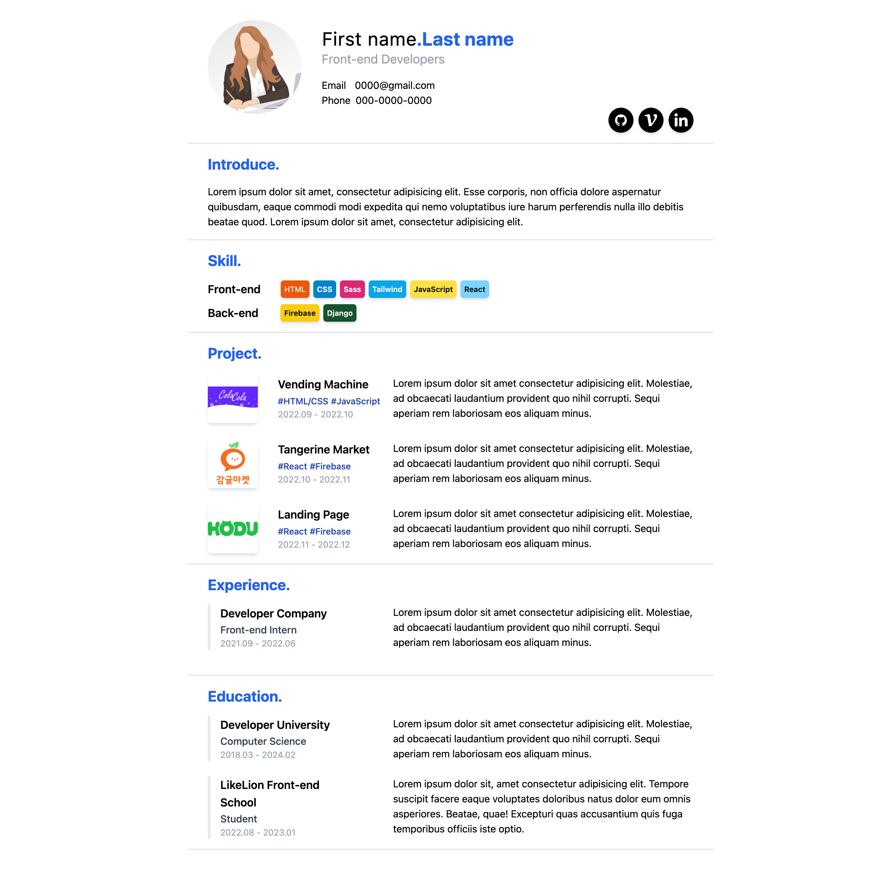

# Resume-Template

멋쟁이사자처럼 프론트엔드스쿨 3기 천하제일 이력서 대회 출품작 ➔ [바로가기](https://yoorimseo.github.io/resume-template/)

 
 

# 1. 이력서 설명

노션의 이력서 템플릿처럼 심플한 템플릿을 제작해보았습니다.

처음으로 Tailwind를 사용해서 만들었기에 코드에 부족한 점이 많습니다.

앞으로 취업 준비를 하며 실제 저의 이력을 작성할 예정입니다.

 
 

 
 

# 2. 이력서 디자인

이력서 디자인은 [피그마](https://www.figma.com/file/w31jmkIl4YSimcS84t2GkK/%EC%B2%9C%ED%95%98%EC%A0%9C%EC%9D%BC-%EC%9D%B4%EB%A0%A5%EC%84%9C-%EB%8C%80%ED%9A%8C---%EC%9D%B4%EB%A0%A5%EC%84%9C-%EB%94%94%EC%9E%90%EC%9D%B8?node-id=0%3A1)에서 확인할 수 있습니다.

피그마 작업이 서투른 초보자라 부족한 점이 많습니다. 이 부분 참고 부탁드립니다.

작업하면서 픽셀 조정을 했기에, 피그마 사이즈와 크기가 동일하지 않을 수 있습니다.
