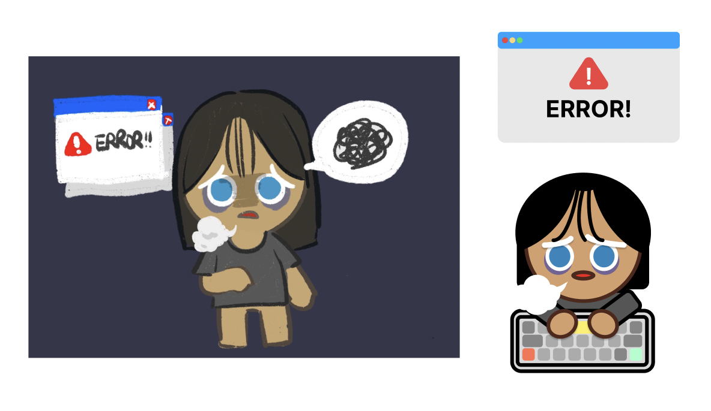

# CSS-Character

멋쟁이사자처럼 프론트엔드스쿨 3기 천하제일 캐릭터 대회 출품작 ➔ [바로가기](https://yoorimseo.github.io/CSS-Character/)

 
 

# 1. 캐릭터 설명

> 천하제일 캐릭터 대회에 개발자 쿠키가 떴다? 

 

## 1-1. 캐릭터 제작 동기

평소 `데브 시스터즈`의 `쿠킹덤`을 즐겨하고 좋아하는 유저입니다.

그래서 `쿠킹덤 쿠키`들에서 영감을 받아 `개발자 쿠키`를 만들게 되었습니다.

 

 

## 1-2. 캐릭터 포인트

-   장시간 모니터를 보고 있어 **맹해진 눈**과 밤 늦게까지 공부하다가 생긴 **다크써클**을 표현했습니다.
-   **에러 메시지**로 인해 힘들어 하는 모습을 **눈을 감으며 한숨을 쉬는** 애니메이션을 사용하여 표현했습니다.

 
 

# 2. 캐릭터 디자인

캐릭터 디자인은 [피그마](https://www.figma.com/file/P2F1OkZP6v819hdBDlejcU/%EC%B2%9C%ED%95%98%EC%A0%9C%EC%9D%BC-%EC%BA%90%EB%A6%AD%ED%84%B0-%EB%8C%80%ED%9A%8C---%EA%B0%9C%EB%B0%9C%EC%9E%90-%EC%BF%A0%ED%82%A4%EC%9D%98-%ED%95%9C%EC%88%A8?node-id=0%3A1)에서 확인할 수 있습니다.

피그마 작업이 서투른 초보자라 부족한 점이 많습니다. 이 부분 참고 부탁드립니다.

작업하면서 픽셀 조정을 했기에, 피그마 사이즈와 크기가 동일하지 않을 수 있습니다.
